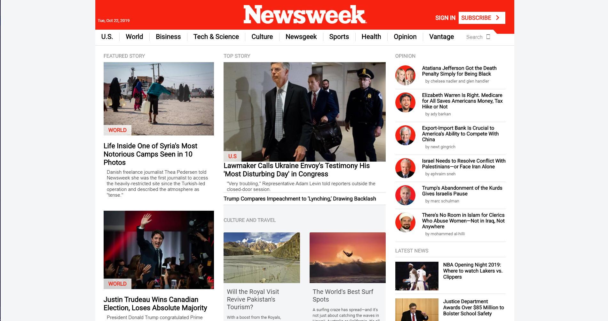

# Using Bootstrap ~ A clone of the Newsweek website

## This is a solo project that consists of building a replica of the news site [newsweek.com](https://www.newsweek.com/) using the Bootstrap framework

### You can find the original project specification [here](https://www.theodinproject.com/courses/html5-and-css3/lessons/using-bootstrap)

|The cloned page screenshot|
|:---:|
||

## Tools Used

- HTML5
- CSS3 & (layout property)
- MarkDown Syntax
- Flex & Grids
- FontAwsome v5.11.2
- Gulp
- SAAS
- browser-sync

## Work Done

- [x] Project Tools SetUp with (Gulp , Gulp Sass , browser-sync)
- [x] Lay out the basic structure of the page using empty semantic HTML elements that are appropriately sized and positioned.
- [x] Use Semantic HTML.
- [x] Use Flex or grid in the project.
- [x] Fill in and position the additional sections.
- [x] Pass CSS stylelint test.
- [x] Check html with W3C validator.
- [x] Validate Readme file with markdown lint.
- [x] Create Fixed Header Nav Bar
- [x] Toggle Nav on Scroll Down
- [x] Create Main Article Section (right , left ) sides
- [x] Create Latest News Section.
- [x] Create CULTURE & TRAVEL Section.
- [x] Create IN THE MAGAZINE Section.
- [x] Create EDITOR'S PICK Section.
- [x] Create FEATURED SLIDESHOWS Section.
- [x] Create Article Div
- [x] Create SUBSCRIBE Section
- [x] Crete footer div

## How to Install and use

- clone the repository `git clone https://github.com/ChristianOtieno/The-News-Week-Clone.git`
- open command prompt in `The-News-Week-Clone` folder
- run the application using open live server functionality.

Link to live demo [here](https://christianotieno.github.io/The-News-Week-Clone/.)

## Author's social links

- Github: [@christianotieno](https://github.com/christianotieno)
- Twitter: [@iamchrisotieno](https://twitter.com/iamchrisotieno)
- Linkedin: [Christian Otieno](https://www.linkedin.com/in/christianotieno/)